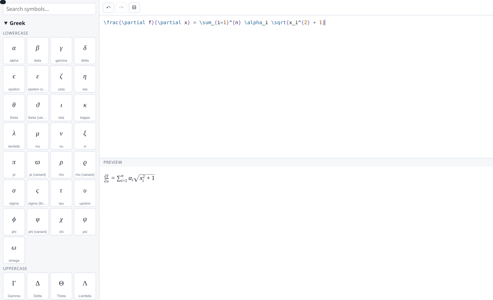

# ImaTeX

A WYSIWYG LaTeX editor for the web: a searchable symbol palette, a highlighted source editor
with hover documentation, and a live preview — in about 800 lines with **no runtime
dependencies**.

Built for [latex.js](https://latex.js.org/), but not welded to it.



## The one design decision worth knowing

**ImaTeX never imports a maths renderer.** It takes a `render(tex, target, display)` callback
and calls it. The host decides whether that is latex.js, KaTeX, MathJax, or a server round
trip. `display` is the toggle's current state, so the preview can be typeset the way the
formula will actually appear; ignore it if that does not matter to you.

```js
const render = (tex, target, display) => {
  const math = display ? `$$${tex}$$` : `$${tex}$`;
  const gen = new latexjs.HtmlGenerator({ hyphenate: false });
  const doc = latexjs.parse(`\\documentclass{article}\\begin{document}${math}\\end{document}`,
                            { generator: gen });
  target.textContent = '';
  // latex.js hands back a whole page body: a `div` holding paragraphs. Take the maths out of
  // it rather than appending it, or you put a block element inside inline content. If your
  // host serialises the result and parses it again, that block closes the enclosing
  // paragraph and the formula walks out of its own sentence.
  const held = document.createElement('div');
  held.appendChild(doc.domFragment());
  const painted = held.querySelectorAll('.katex-display').length
    ? held.querySelectorAll('.katex-display') : held.querySelectorAll('.katex');
  if (!painted.length) throw new Error('no maths in that');
  for (const el of painted) target.appendChild(el);
};
```

That is what keeps the package dependency-free and what lets it outlive whichever renderer is
fashionable. The same reasoning runs through the rest: it builds plain DOM behind a small
imperative API, so React, Angular, Vue or nothing at all can host it, and every colour and
metric is a CSS custom property with a working fallback, so a host can pass its own palette
without forking the stylesheet.

## Use it

### Plain JavaScript

```js
import { ImaTeX } from 'imatex';
import 'imatex/imatex.css';

const editor = new ImaTeX({
  mount: document.querySelector('#host'),
  value: '\\frac{a}{b}',
  render,
  onChange: (tex) => console.log(tex),
});
```

### As a popup

```js
import { openImaTeX } from 'imatex/modal';

openImaTeX({ value: existing, render, onSubmit: (tex, display) => insert(tex, display) });
```

### As a custom element

```js
import 'imatex/element';

const node = document.createElement('imatex-editor');
node.renderer = render;
node.value = '\\alpha^2';
node.addEventListener('imatex-submit', (e) => console.log(e.detail.value));
```

### In a framework

There is nothing to integrate. Mount it in whatever your framework calls a ref, and destroy it
on teardown:

```jsx
useEffect(() => {
  const ed = new ImaTeX({ mount: ref.current, render, onChange: setTex });
  return () => ed.destroy();
}, []);
```

## What it does

| | |
|---|---|
| **Symbol palette** | 291 commands in 8 categories and 19 groups, each drawn with your own renderer so the button shows the glyph it will insert. Searchable by command or by what it is called. |
| **Snippets with tab stops** | `\frac{#}{%}` puts the caret in the numerator; Tab jumps to the denominator. Selecting `x` and choosing `\sqrt` gives `\sqrt{x}` rather than replacing it. |
| **Syntax highlighting** | Commands, braces, scripts, alignment, numbers, comments — and an unknown command is underlined, so a typo is visible before the preview fails. |
| **Hover documentation** | Hovering a command says what it means and where it lives in the palette. `\begin` inside a `cases` block names the environment. |
| **Live preview** | Debounced, in inline or display mode. An invalid formula reports quietly: half-typed maths is the normal state while working, not an error to shout about. |
| **Undo / redo** | Ctrl+Z, Ctrl+Y, and buttons. Typing coalesces into one step; an insertion from the palette is always its own, because that is what you want to take back in one press. |
| **Brace checking** | The one mistake that is both commonest and hardest to see. Not a validator — the renderer is the authority on validity, and it says so in the preview. |

## Styling

Every token is a custom property. Hand it a palette:

```css
.imatex {
  --imatex-bg: #fff;     --imatex-panel: #f6f7f9;  --imatex-fg: #1b2330;
  --imatex-muted: #667085; --imatex-line: #d8dee9; --imatex-accent: #2f6fdd;
  --imatex-c-command: #2f6f9f; --imatex-c-brace: #8a56c9;   /* … */
}
```

## Honest limits

- **"All of LaTeX" is not a finite thing.** LaTeX is a macro language and any package adds
  more. The catalogue aims at complete coverage of the *maths* command space that latex.js and
  KaTeX actually implement, which is what a technical author needs; the tokenizer and the
  highlighter handle arbitrary commands whether or not the catalogue knows them, and an
  unrecognised one is marked rather than hidden.
- **The preview is the renderer's opinion, not ours.** ImaTeX does not parse LaTeX
  semantically; it tokenizes for colour and hover, and asks the renderer whether it is valid.
- **One caret marker per snippet.** `#` is where the caret lands; `%` is a further stop.

## Development

```
npm test          # the tokenizer and catalogue; no DOM needed
npm run demo      # then open http://localhost:8792/demo/ (fetch latex.js into demo/ first)
```

The UI is exercised in a real browser rather than a DOM shim, because the things that go wrong
with it — overlay alignment, lazy glyph rendering, caret hit-testing — are exactly the things a
shim reports as working.

## Licence

MIT © Imatest LLC
